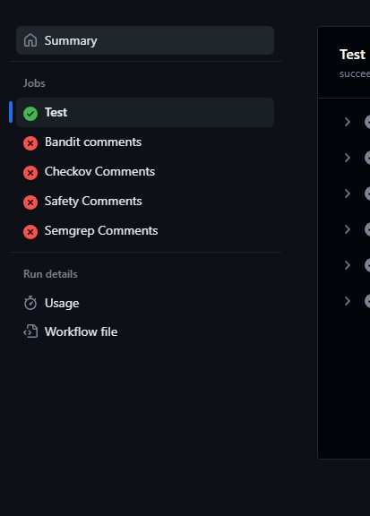
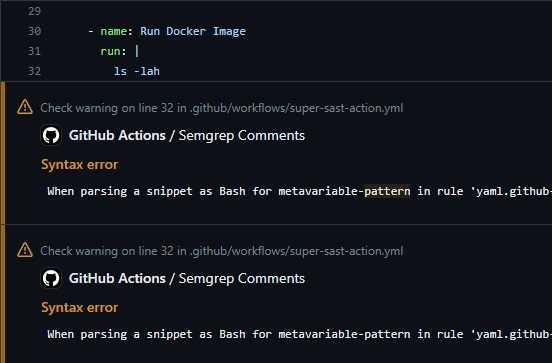

## super-sast-action
This <a href="https://github.com/features/actions">GitHub Action</a> runs Super SAST, 
a docker image that runs several SAST checks on your code,
and annotates the interested lines with the reported issues.

The action is run in the workflow:

The interested LoC are shown in the PR

